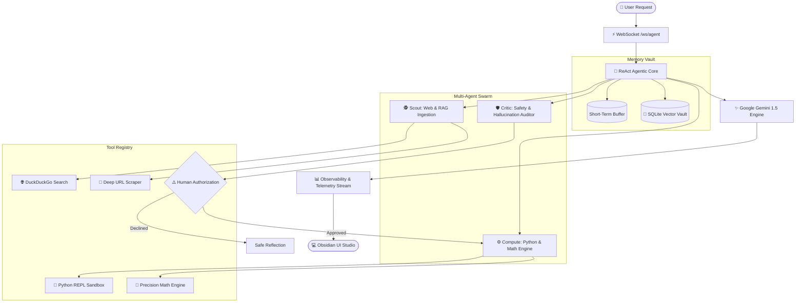

<div align="center">

<!-- 🌟 Live Animated Typing Header -->
<a href="https://github.com/Snehachoudhary26/OmniAgent">
  
</a>

<p align="center">
  <b>Next-Generation Autonomous Agentic AI Workspace</b>
</p>

<!-- 🚀 Glowing Live Badges -->
<p align="center">
  
  
  
  
  
  
</p>

<p align="center">
  <a href="#-features">✨ Features</a> •
  <a href="#-architecture">🧠 Architecture</a> •
  <a href="#-multi-agent-swarm">🤖 Swarm</a> •
  <a href="#-quick-start">🚀 Quick Start</a> •
  <a href="#-deployment-to-vercel">🌐 Deploy to Vercel</a>
</p>

---

</div>

## 🌟 Overview

**OmniAgent** is an enterprise-grade Autonomous Agentic AI studio that breaks down user requirements into autonomous goals, executes multi-step ReAct reasoning loops, interacts with live tools, and streams results over real-time WebSockets.

---

## ✨ Features

```
├── 🧠 Autonomous ReAct Engine   ── Thought ➔ Action ➔ Reflection ➔ Synthesis loop
├── 🤖 Multi-Agent Swarm         ── Scout, Compute, and Safety Critic sub-agents
├── 📂 Dual-Tier RAG             ── Ingest .txt, .md, .py, .pdf files + live web scraping
├── 🐍 Python REPL Sandbox       ── In-browser code execution with stdout inspection
├── 🛡️ Human-in-the-Loop Gate    ── Supervisor authorization on sensitive tool actions
├── 🗄️ Relational Database       ── Persistent SQLite storage for users & memory chunks
└── 🎨 Dual Luxury Cyber Themes  ── Obsidian Night Mode & Pure Snow-White Day Mode
```

---

## 🧠 Architecture



---

## 🤖 Multi-Agent Swarm

| Agent | Role | Capabilities | Primary Function |
|---|---|---|---|
| 🕵️ **Scout Agent** | Web & RAG Researcher | DuckDuckGo, BeautifulSoup Scraper, Vector Vault | Gathers grounded intelligence and extracts verified citations. |
| ⚙️ **Compute Agent** | Execution & Logic Engine | Sandboxed Python REPL, Precision Math | Executes mathematical scripts and data transformations. |
| 🛡️ **Safety Critic** | Safety & Hallucination Auditor | Human-in-the-Loop Gateway, Schema Validator | Evaluates execution safety and requests supervisor authorization. |

---

## 🛠️ Tool Registry

<details>
<summary>🔍 Expand Tool Capabilities</summary>
<br>

- 🌐 **web_search** — Real-time DuckDuckGo search querying live news, documentation, and web data.
- 🔗 **deep_url_researcher** — Extracts, cleans, and indexes article contents from any public URL.
- 🐍 **python_executor** — Executes code algorithms inside an isolated sub-process with captured stdout/stderr.
- 📐 **math_calculator** — Evaluates complex scientific and arithmetic mathematical formulas safely.
- 🧠 **knowledge_retriever** — Semantically recalls facts and ingested documents from the Vector Vault.

</details>

---

## 🚀 Quick Start

### 1. Clone Repository

```bash
git clone https://github.com/Snehachoudhary26/OmniAgent.git
cd OmniAgent
```

### 2. Install Virtual Environment

```bash
python3 -m venv venv
source venv/bin/activate
pip install -r requirements.txt
```

### 3. Add Gemini API Key (Optional)

Create a `.env` file in the root folder:

```env
GEMINI_API_KEY=AIzaSyYourSecretKeyHere
```

### 4. Run Studio Locally

```bash
uvicorn app.main:app --reload --port 8000
```

Visit **http://localhost:8000** in your browser!

---

## 🌐 Deployment to Vercel

**1.** Push your code to GitHub:

```bash
git add .
git commit -m "feat: complete omniagent studio"
git push origin main
```

**2.** Go to **Vercel** ➔ **Add New Project** ➔ **Import OmniAgent**.

**3.** Under **Environment Variables**, add `GEMINI_API_KEY`.

**4.** Click **Deploy!** 🚀

---

<div align="center">

Made with ❤️ using ReAct Agentic Architecture

</div>
